# WDO - Web Designe Online  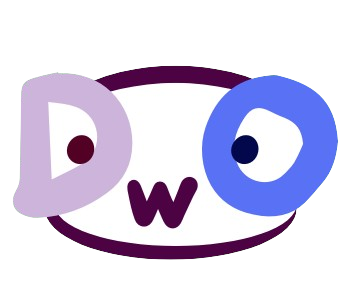

## Proposta  

Imagina um site de freelancers... mas só para designers! Isso mesmo, um lugar exclusivo para conectar empresas e pessoas que precisam de design com profissionais criativos e talentosos.

E agora vamos dizer que você tem uma empresa e precisa de uma identidade visual própria. Você acessa nosso site, navega pelas categorias e escolhe exatamente o serviço de design que está procurando: logotipo, identidade visual, posts para redes sociais, ilustrações, embalagem... o que precisar!

E a melhor parte? Nosso site tem um chat interativo, onde você conversa diretamente com o designer. Nada de esperar e-mails demorados ou perder tempo com burocracia. Você explica sua ideia, negocia valores e acompanha o progresso do seu projeto em tempo real. Simples, direto e eficiente.

## Banco de dados  

Nosso banco de dados foi feito na proposta de atender o cliente da forma mais rapida e melhor, nele contemos dois diagramas, um de entidade de relacionamento e outro de classes.

 

--------------------

## Design  

Nosso design foi pensado para atender todos os tipos de clientes, desde mais velhos a ate mais novos, com cores e paletras agradaveis visualmente podemos atrair todo o tipo de publico para o nosso site. O design dele foi pesando tambem para ser de facil acesso e agil, tendo funções bem destacadas e diretas, dificilmente ficaram perdidos no nosso site!

Modificamos o design do protótipo para acrescentar mais páginas pois estava faltando algumas informações, colocamos mais implementos e modificamos algumas páginas que estavam prontas, modificamos a cor que estava muito infantil e a tipografia do site, deixamos mais organizado

 
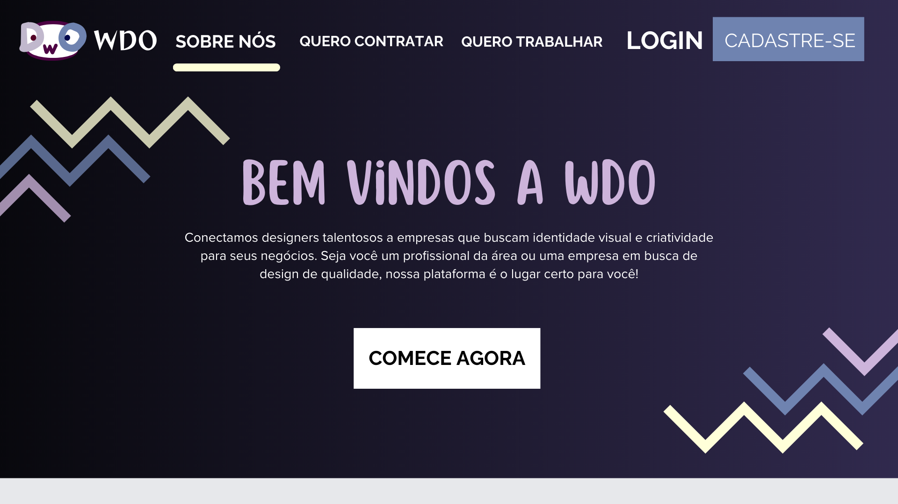
 

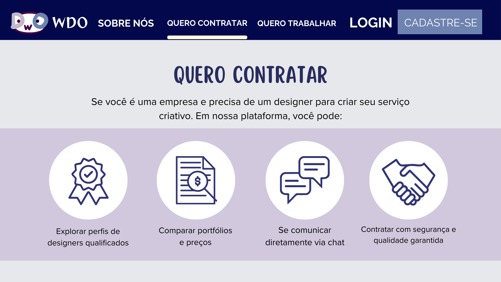
 

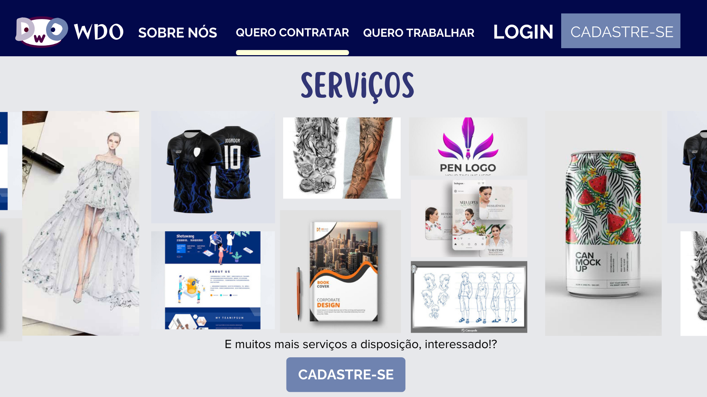
 

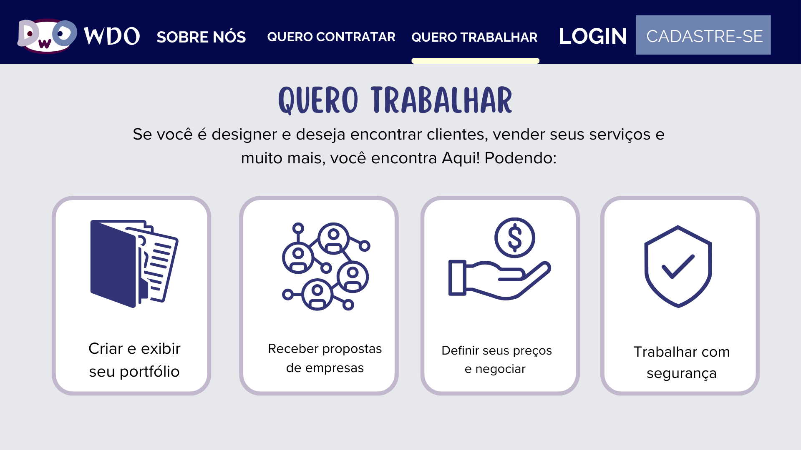
 

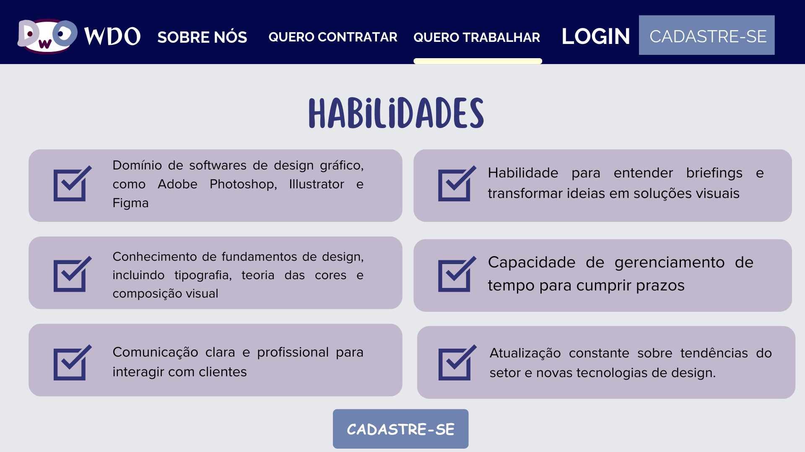
 

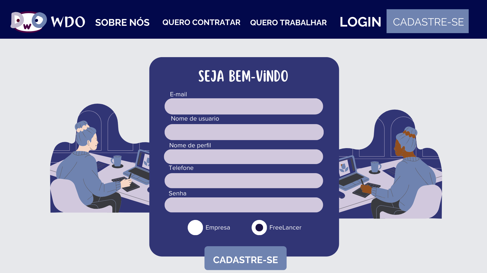
 

 

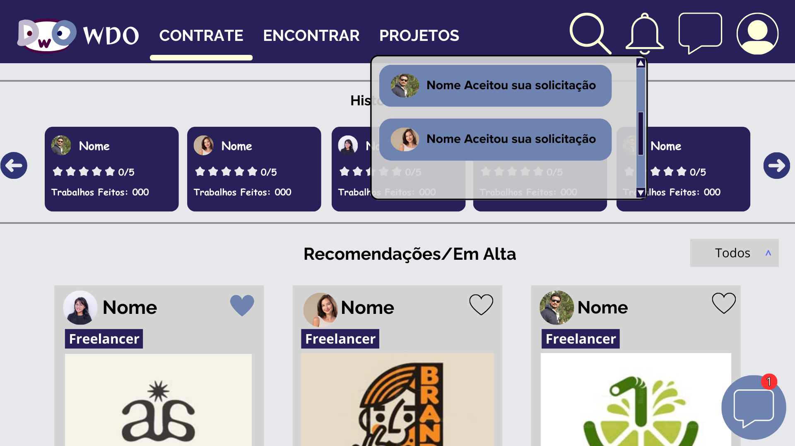
 

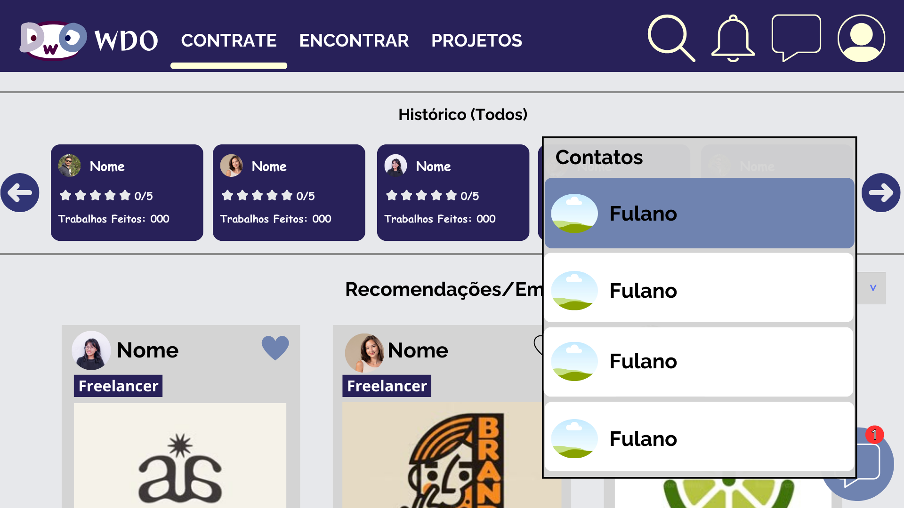
 

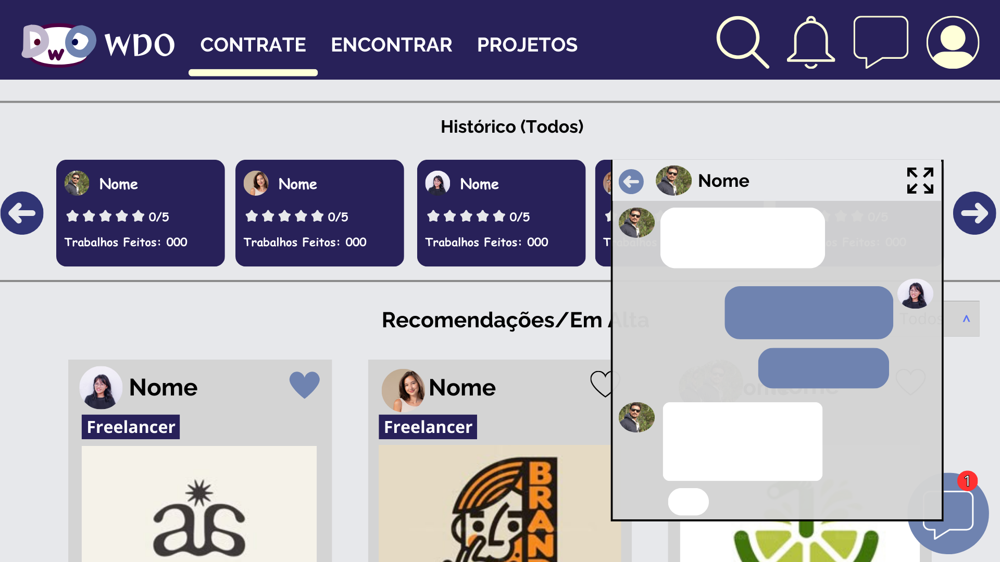
 

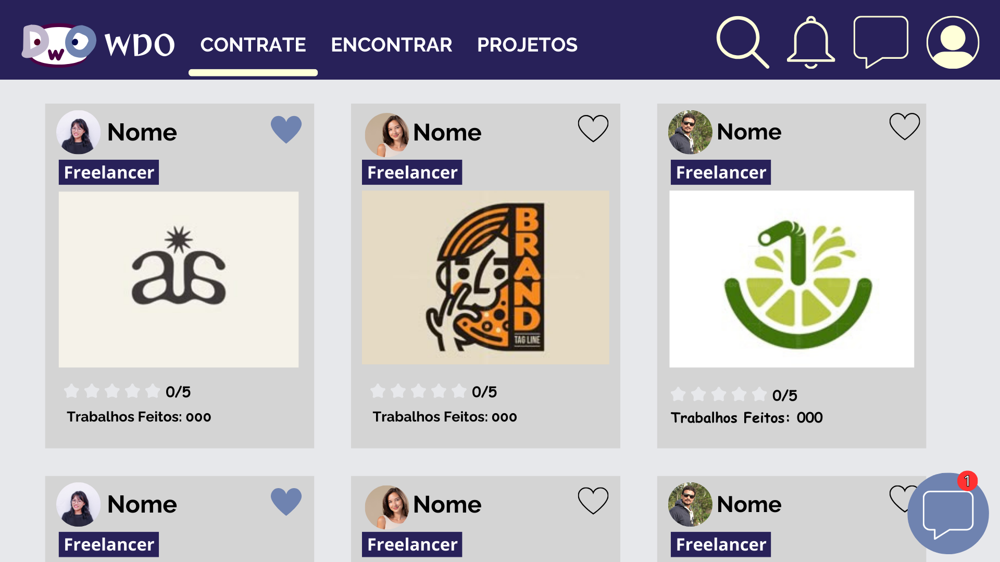
 

 

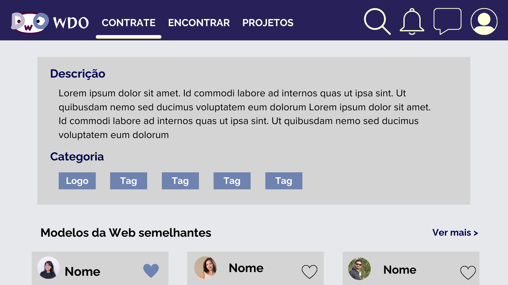
 

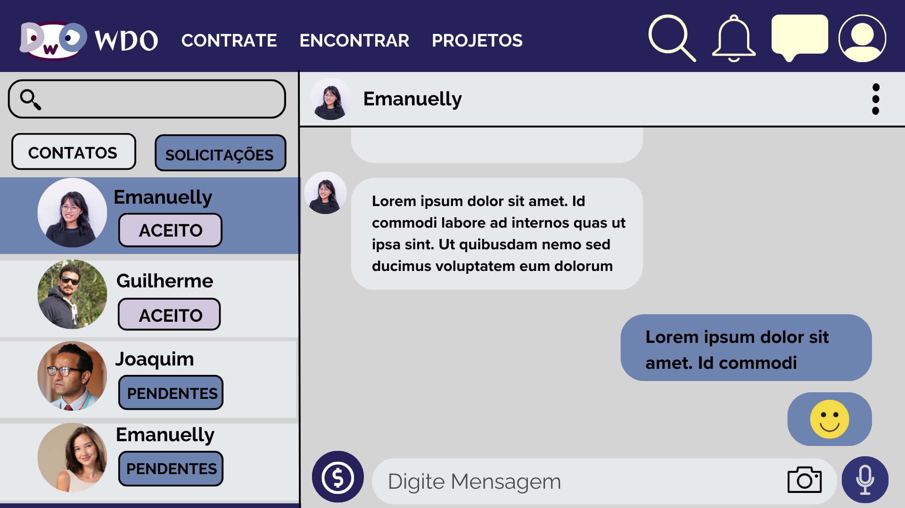
 

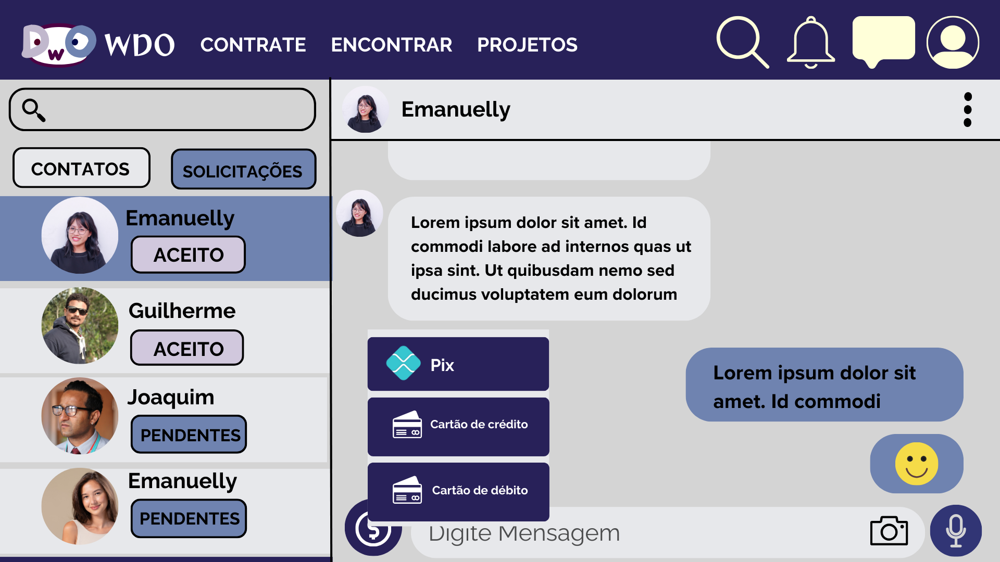
 

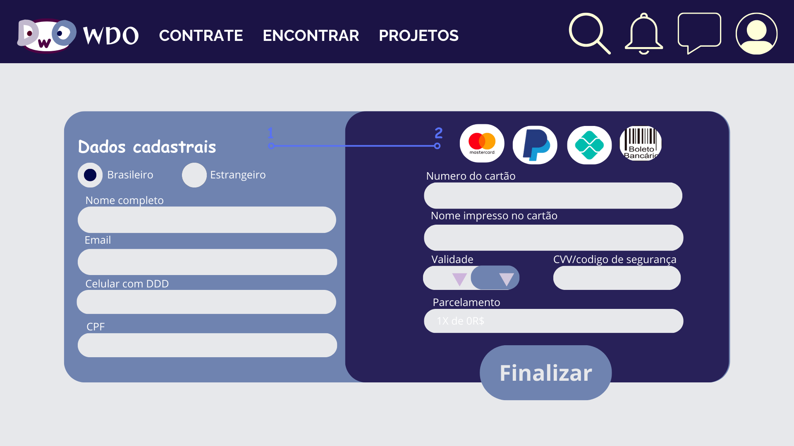
 

 

 

 

 

 

 

 

 

 

 

 
